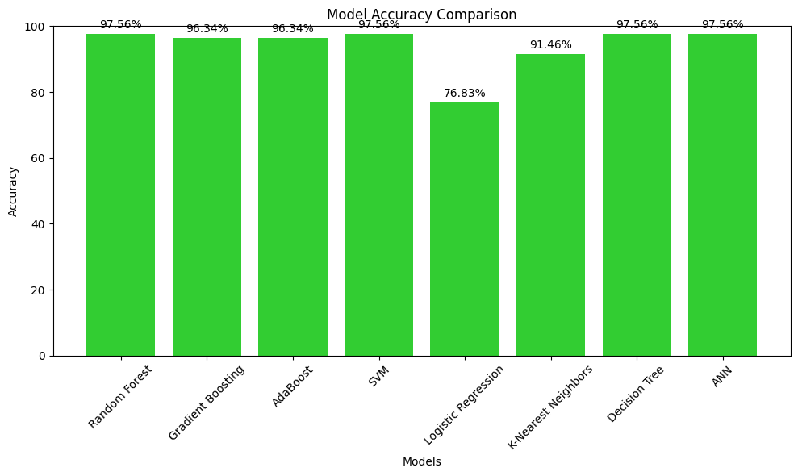

# Bank Distress Prediction

## Description
Developed a predictive model to assess the likelihood of bank distress using machine learning algorithms based on Performance Matrix and compared the result with previously established z-score method.

## Techniques and Tools
- Data preprocessing, feature engineering,
- Modesl: gradient boosting, adaboost, SVM, logistic regression, random forest, K-nearest neighbors, decision tree and CNN.
- Tools: Python (pandas, scikit-learn).

## Results
Achieved an accuracy of 97.56% with a recall of 98% in identifying distressed banks (random forest, SVM, decision tree, CNN) based on performance matrix. For z-score it falls around 50%. From this we can understand previously established approach solely based on z-score is insufficient in detecting if a bank is in finanacial distress or not.

  <table>
    <tr>
      <td>
        
      </td>
      <td>
        
      </td>
    </tr>
  </table>

## Usage
Instructions on how to run the project:
1. Copy the project in colab.
2. Store the dataset in the appropriate drive location.
3. Follow step by step execution in order.
4. Please contact me for the dataset.
   
## Google Colab Notebook
[Google Colab Notebook](https://colab.research.google.com/drive/11Y7IiBt3fiE0obpdDUig-7l9zLYdYaQg?usp=sharing)
